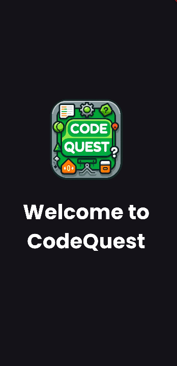
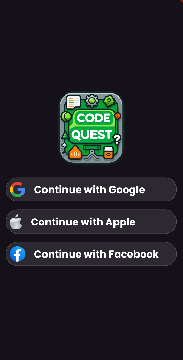
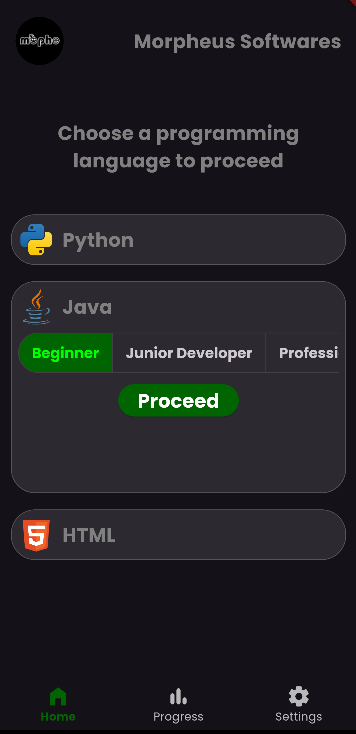
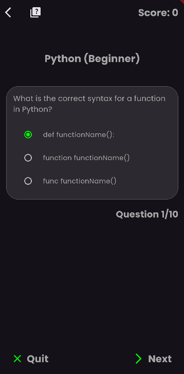

# CodeQuest

Code Quest is a Flutter-based educational quiz app designed to help users learn various programming
languages. The app integrates with Firebase for authentication and Firestore for managing quiz data.
Users can sign in using Google authentication, select their programming language and difficulty
level, and then take quizzes to test their knowledge.

## Features

- Google Sign-In for authentication.
- Supports multiple programming languages (starting with Python).
- Dynamic difficulty levels: Beginner, Junior Dev, and Professional.
- Quiz questions fetched from Firestore.
- Score tracking and quiz result display.
- Clean and intuitive UI with Material Design.

## Tech Stack

- **Flutter**: Mobile UI framework for building cross-platform apps.
- **Firebase**: Backend services for authentication and Firestore database.
- **Google Sign-In**: Easy Google authentication integration.

## Screenshots






## Getting Started

To get started with the project, follow these steps:

### Prerequisites

- [Flutter](https://flutter.dev/) installed on your machine.
- The Firebase project was set up with Firestore, and authentication was enabled.
- A Google account for OAuth credentials.

### Setup Firebase

1. Go to the [Firebase Console](https://console.firebase.google.com/) and create a new project.
2. Enable **Authentication** with **Google Sign-In** method.
3. Set up **Firestore** and create a collection named `quiz_questions` with documents containing
   fields for:
    - `question`: The quiz question (string).
    - `options`: An array of possible answers.
    - `correctAnswer`: The correct answer.
    - `language`: The programming language (e.g., Python).
    - `difficulty`: The difficulty level (e.g., Beginner, Junior Dev, Professional).
4. Download the `google-services.json` file and place it in the `android/app` directory.

### Installation

1. Clone the repository:

    ```bash
    git clone https://github.com/Morpheus-Softwares/CodeQuest.git
    ```

2. Navigate to the project directory:

    ```bash
    cd code-quest
    ```

3. Install the necessary dependencies:

    ```bash
    flutter pub get
    ```

4. Ensure you have the Firebase CLI installed and linked to your Firebase project.

5. Set up Firebase:

    ```bash
    firebase init
    ```

6. Run the app on your desired platform:

    ```bash
    flutter run
    ```

## Project Structure

The app is divided into several components:

lib/
└── main.dart # App entry point
└── auth_screen.dart # Google Sign-In screen
└── home_screen.dart # Home screen
└── quiz_screen.dart # Quiz interface

assets/
└── images/ # Image assets

pubspec.yaml # Project dependencies and configuration

## How to Use

1. Launch the app.
2. Sign in using your Google account.
3. Select a programming language and difficulty level.
4. Take a quiz and answer questions by selecting from the options.
5. View your score after completing the quiz.

## Firestore Data Structure

In Firestore, questions are stored under the collection `quiz_questions`. Each document represents a
quiz question with the following fields:

- `question`: The text of the quiz question.
- `options`: An array of possible answers.
- `correctAnswer`: The correct answer string.
- `language`: The programming language (e.g., Python).
- `difficulty`: The difficulty level (e.g., Beginner, Junior Dev, Professional).

Example document:

```json
{
  "question": "What is the correct syntax for a function in Python?",
  "options": [
    "def functionName():",
    "function functionName()",
    "func functionName()"
  ],
  "correctAnswer": "def functionName():",
  "language": "Python",
  "difficulty": "Beginner"
}
```

## Contributing

Contributions are welcome! If you'd like to contribute to this project, please fork the repository
and make changes as you'd like. Submit a pull request for review.

## License

This project is licensed under the MIT License. See the [LICENSE](LICENSE) file for more details.

### Additional Notes:

- Update the Firebase setup instructions according to your actual configuration.
- Replace placeholder GitHub URLs, screenshots, and other links with your real content.
- You can customize the `Firestore Data Structure` section based on your actual quiz schema.

**a.** Add unit tests for authentication or Firestore interaction.  
**b.** Set up CI/CD for automatic testing on pull requests in GitHub.
